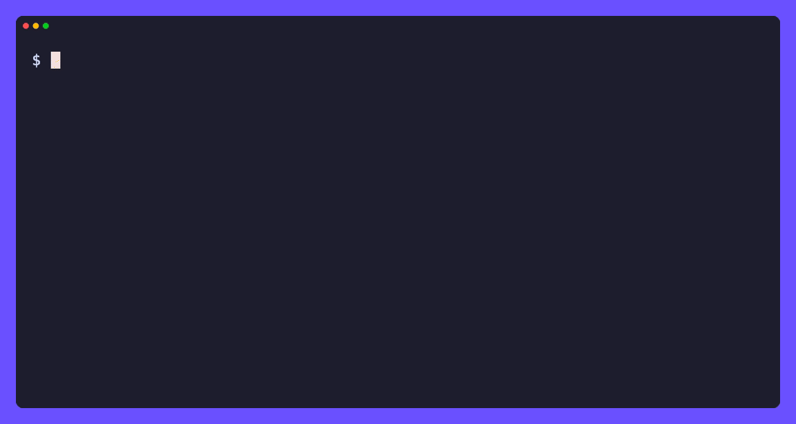

# tt

[](https://github.com/tamnd/tiktok-cli/actions/workflows/ci.yml)
[](https://github.com/tamnd/tiktok-cli/releases/latest)
[](https://pkg.go.dev/github.com/tamnd/tiktok-cli)
[](https://goreportcard.com/report/github.com/tamnd/tiktok-cli)
[](./LICENSE)

A command line for TikTok. `tt` reads public TikTok data and prints clean,
pipeable records. One pure-Go binary, no API key, no login.

[Install](#install) • [Commands](#commands) • [Usage](#usage) • [Two planes](#two-planes-two-reliabilities) • [Serve](#serve-it)



It reads the same public surface a logged-out browser sees: the server rendered
universal-data blob embedded in each page, and the `www.tiktok.com/api/*`
endpoints the page's own JavaScript calls, signed the way the web client signs
them. Every request is paced, retried on transient failures, and sent with an
honest User-Agent.

`tt` is an independent tool. It is not affiliated with, authorized, or endorsed
by ByteDance or TikTok.

## Install

```bash
go install github.com/tamnd/tiktok-cli/cmd/tt@latest
```

Or grab a prebuilt binary from the [releases](https://github.com/tamnd/tiktok-cli/releases),
or run the container image:

```bash
docker run --rm ghcr.io/tamnd/tiktok:latest --help
```

Shell completion is built in: `tt completion bash|zsh|fish|powershell`.

## Commands

| Command | Reads |
| --- | --- |
| `tt video <url-or-id>` | one video record |
| `tt user <handle>` | a profile record |
| `tt posts <handle>` | a user's public videos |
| `tt comments <url-or-id>` | comments under a video |
| `tt replies <url-or-id> <comment-id>` | replies under one comment |
| `tt hashtag <name>` | a hashtag record, or its videos with `--videos` |
| `tt sound <url-or-id>` | a sound record, or its videos with `--videos` |
| `tt search <query>` | mixed video and user hits |
| `tt users <query>` | user search hits |
| `tt trending` | the logged-out recommend feed |
| `tt discover` | walks the public graph from seeds and ranks the hottest nodes |
| `tt raw <url>` | a page's raw universal-data blob |

Every command also answers over HTTP (`tt serve`) and as an MCP tool (`tt mcp`).
Full reference and guides live at [tiktok-cli.tamnd.com](https://tiktok-cli.tamnd.com).

## Usage

```bash
tt video https://www.tiktok.com/@tiktok/video/7106594312292453675
tt user tiktok
tt posts @tiktok -n 30
tt comments 7106594312292453675 --author tiktok
tt hashtag minecraft --videos -n 50
tt sound 7106594280055130923 --videos
tt search "study with me" -n 20
tt trending -n 30
tt discover --seed-video 7106594312292453675 --top 20
```

Records come out as table, JSON, JSONL, CSV, TSV, url, or raw:

```bash
tt video 7106594312292453675 --author tiktok -o json
tt posts @tiktok -o csv --fields id,desc,digg_count,play_count
tt trending -o url            # just the links
tt user tiktok --template '{{.unique_id}} {{.follower_count}}'
```

The same operations are also available over HTTP and as an MCP tool set, and the
package doubles as a [resource-URI driver](#use-it-as-a-resource-uri-driver) for
[ant](https://github.com/tamnd/ant). All of it is wired by the
[any-cli/kit](https://github.com/tamnd/any-cli) framework, so one declaration of
each command drives every surface.

### Global flags

```
-o, --output      table|json|jsonl|csv|tsv|url|raw   (auto: table on a TTY, jsonl when piped)
    --fields      comma-separated columns to include
    --no-header   omit the header row in table/csv/tsv
    --template    Go text/template applied per record
-n, --limit       max records (0 = command default)
-q, --quiet       suppress progress on stderr
    --color       auto|always|never  (color tables and JSON on a terminal)
    --rate        min spacing between requests (default 600ms)
    --timeout     per-request timeout (default 30s)
    --retries     retry attempts on 429/5xx (default 5)
    --user-agent  override the User-Agent
    --db          tee every record into a store (e.g. out.db)
```

## Two planes, two reliabilities

TikTok serves data through two channels that fail differently.

The **SSR plane** reads the JSON a logged-out page already ships. A video page
carries the whole video record, its author, its sound, its hashtags, and its
counters, with no signing. `tt video`, `tt hashtag`, `tt sound`, and `tt raw`
ride it and are the reliable commands.

The **API plane** calls `www.tiktok.com/api/*` for listings, comments, and
search. Those calls carry an X-Bogus signature and an msToken, and they sit
behind a Web Application Firewall that scores the caller's IP and session. From
a residential browser session they answer. From a datacenter IP they are often
gated. `tt posts`, `tt comments`, `tt search`, and `tt trending` ride this
plane. When the firewall gates a call, `tt` exits 4 with a clear message instead
of pretending it found nothing.

`tt discover` walks the public graph from one or more seeds and ranks the
hottest users, videos, hashtags, and sounds it reaches. It crosses both planes,
so from a datacenter IP it reaches what the page blobs give (a video's author,
sound, and mentioned users) and records every list edge it could not page. See
the [discovery guide](https://tiktok-cli.tamnd.com/guides/discovering-hot-nodes/).

## Exit codes

```
0  success, at least one record
1  error
2  usage error
3  no data (a valid empty result)
4  walled (the firewall gated this surface; it needs a residential session)
6  not found (the handle, video, hashtag, or sound does not exist)
```

## Serve it

The same operations are available over HTTP and as an MCP tool set for agents,
with no extra code:

```bash
tt serve --addr :7777    # GET /v1/user/<handle> returns NDJSON
tt mcp                   # speak MCP over stdio
```

## Use it as a resource-URI driver

`tt` registers a `tiktok` domain the way a program registers a database driver
with `database/sql`. A host enables it with one blank import:

```go
import _ "github.com/tamnd/tiktok-cli/tiktok"
```

Then [ant](https://github.com/tamnd/ant) (or any program that links the package)
dereferences `tiktok://` URIs:

```bash
ant get tiktok://user/tiktok                  # the profile record
ant get tiktok://video/7106594312292453675    # one video
ant ls  tiktok://user/tiktok                   # the user's videos
ant cat tiktok://video/7106594312292453675     # just the description text
ant url tiktok://hashtag/minecraft             # the live https URL
```

## Development

```
cmd/tt/        thin main: hands cli.NewApp to kit.Run
cli/           assembles the kit App and the version and raw escape-hatch commands
tiktok/        the library: HTTP client, SSR parsing, signed API calls, models,
               the kit operations, and the tiktok:// driver
pkg/ttsign/    msToken and the X-Bogus / a_bogus signatures
pkg/tthtml/    pull a named <script> JSON blob out of a page
docs/          tago documentation site
```

```bash
make build      # ./bin/tt
make test       # go test ./...
make vet        # go vet ./...
```

## Releasing

Push a version tag and GitHub Actions runs GoReleaser, which builds the
archives, Linux packages, the multi-arch GHCR image, checksums, SBOMs, and a
cosign signature:

```bash
git tag v0.1.0
git push --tags
```

The image tag carries no `v` prefix (`ghcr.io/tamnd/tiktok:0.1.0`). The Homebrew
and Scoop steps self-disable until their tokens exist, so the first release
works with no extra secrets.

## License

Apache-2.0. See [LICENSE](LICENSE).
